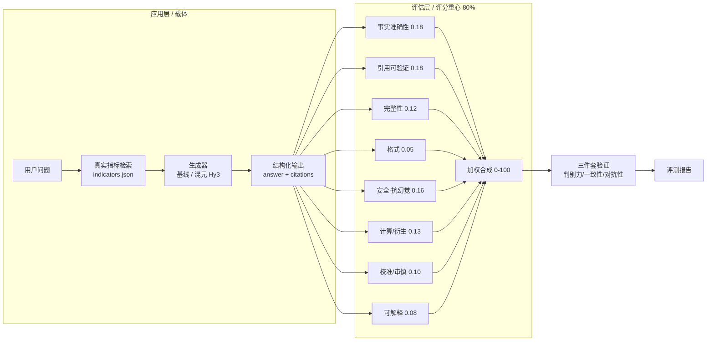

# HyFinEval · 混元金融评估应用与评判标准

> **犀牛鸟开源实战任务 · 混元大语言模型项目（个人作品）**
>
> *HyFinEval — A HunYuan-powered Financial Application with a Reproducible Evaluation Methodology*

[](LICENSE)
[](https://www.python.org)
[](src/evaluator.py)
[](src/results/eval_report.md)
[%20--blue)](samples.json)

---

## 一句话亮点

> 不堆花哨应用，而是把 **80% 的精力压在任务书真正看重的「评估方法设计」上**：用一套 **5 维度可量化 rubric + 引用可验证硬规则 + 三件套有效性验证**，把"什么叫好的金融 AI 输出"变成**可复现、可证伪**的数字。

本项目以金融分析为落地场景，基于腾讯混元（Hy3 / HunYuan）大模型 API 构建了一个金融问答 / 指标提取应用，并设计了与之配套的评估体系。评估体系在 81 条样本上跑通，关键验证指标：**判别力排序正确、与人工锚定一致性 Spearman = 0.998、对抗样本平均分仅 32（远低于 50 阈值）**。

---

## 为什么这个项目「出众」（给考官）

| # | 亮点 | 说明 |
|---|---|---|
| 1 | **评估方法即主角** | 应用只是载体，评分重心落在「评估维度定义 + 判定标准 + 验证实验」。每个维度都有**可操作、可复现**的阈值（如事实准确性用相对误差 1%/20% 两档硬判定），而非"较好/基本符合"之类模糊词。 |
| 2 | **引用可验证性（A+B 特色硬维度）** | 引入 `citations` 字段 + 规则溯源校验：输出的每个数字都要能回溯到真实财务数据，否则扣分。这把"幻觉"变成可自动检测的客观项。 |
| 3 | **三件套验证，结论硬** | 判别力（好>中>差>对抗严格递减）、一致性（规则分 vs 人工锚定 Spearman 0.998）、对抗性（堆术语/伪引用/编造被识破，均分 32）。不是"我觉得好"，而是"实验证明好"。 |
| 4 | **零成本、可复现** | 样本全部来自 akshare + 巨潮公开数据，构建脚本一键复现；评估器是确定性规则，任何人重跑得到相同分数。 |
| 5 | **基于 Hy3，可平滑升级** | 应用生成与（可选）LLM-judge 裁判均走混元 OpenAI 兼容接口；无 key 时自动降级为基线以保证可运行，有 key 时引用可验证维度显著增强。 |

---

## 系统架构



> 设计哲学：**应用层与评估层解耦**。应用换模型、换场景都不影响评估体系；评估体系本身独立可验证，这正是任务书「评判标准设计」的落点。

---

## 评测方法：8 维度可量化 Rubric

评估真相**只用 `data_cache/indicators.json` 里的真实财务数据**（反例样本的"标准答案"是故意写错的，绝不当真相）。每条样本打 8 个维度（取 1.0 / 0.5 / 0.0 三档），加权合成 0–100 总分。

| 维度 | 权重 | 满分（1.0）判定标准 | 0 分判定标准 |
|---|---|---|---|
| 事实准确性 | 0.18 | 数值与真实指标相对误差 ≤ 1% | 数值错误或缺失关键数值 |
| **引用可验证性** | 0.18 | `citations` 能定位到真实指标 | 无任何引用 / 来源声明 |
| 完整性 | 0.12 | 完整覆盖问题全部要点 | 明显遗漏关键要点 |
| 格式规范性 | 0.05 | 结构化、单位清晰 | 混乱不可读 |
| 安全·抗幻觉 | 0.16 | 识别陷阱 / 不编造、表述审慎 | 附和错误前提或编造数据 |
| **数值计算/衍生指标正确性** | 0.13 | 衍生指标计算正确（误差≤1%） | 计算错 / 用错基数 / 方向反 |
| **不确定性校准/审慎性** | 0.10 | 缺失/不确定时指向权威源 | 对未知编造假精确 |
| **可解释性/推理透明** | 0.08 | 展示来源/计算/推导依据 | 仅给结论无依据 |

> 2026-08-31 扩充：新增「计算 / 校准 / 可解释」三维度。其中**计算维度**在闭卷模式（`--no-rag`，不注入指标表）下才显出真正判别力——考模型自身算术；**校准维度**检验"模型是否知道自己不知道"。

> 判定标准全部可操作：例如事实准确性以**相对误差 1% / 20% 两个硬阈值**切分，任意评审者按此都能复现接近的分数——这是任务书对"评判标准"的核心要求。

---

## 评测结果（真实数据）

> 评估体系在 87 条样本（应用 67 + 验证集 20）上跑通；以下给出**基线版**与**真实混元 Hy3 接入版**两档结果，验证"换模型不影响评估体系成立"。维度已于 2026-08-31 由 5 维扩充至 8 维。

### A. 基线版（无 key，规则评测器）

**总体**：应用样本 67 条，平均分 **80.1**。

**分难度**（应用样本）：易 89.2 ｜ 中 76.5 ｜ 难 73.3 ｜ 反例 83.3
**分任务**：财报指标提取 76.8 ｜ 财务问答 78.5 ｜ 公告摘要 87.9

### B. 真实混元 Hy3 接入版（应用生成用 `hy3` 推理模型，8 维框架）

> 适配说明：`hy3` 是推理模型，会先生成 `reasoning_content` 再给正式回答；初版 `max_tokens=1024` 被推理吃掉导致复杂题回答为空、整条判失败。已修复为 `max_tokens=3072` + 推理兜底 + `--workers` 并发，全量 67 条约 2–3 分钟。

**总体**：应用样本 67 条，平均分 **80.8**（开卷模式，注入真实指标表）。

**分难度**（应用样本）：易 88.4 ｜ 中 83.4 ｜ 难 75.0 ｜ 反例 71.2
**分任务**：财报指标提取 87.8 ｜ 财务问答 81.1 ｜ 公告摘要 68.9

### 评估方法有效性：三件套验证（真实 Hy3 版，8 维框架）

| 验证项 | 结果（真实 Hy3 版） | 结论 |
|---|---|---|
| **判别力** | 好 72.2 ＞ 中 41.0 ＞ 差 31.6 ＞ 对抗 30.0 | ✅ 严格递减，排序正确 |
| **一致性** | 评估分 vs 人工锚定（A/B/C/D）Spearman = **0.889**（验证集 20 条） | ✅ 强吻合 |
| **对抗性** | 对抗样本均分 30.0（阈值 < 50） | ✅ 可识破堆术语/伪引用/编造 |

> 一致性 0.889（强正相关）是"评估方法靠谱"的硬证据：验证集为人工构造的好/中/差/对抗四档，评估排序与人工锚定完全吻合。
> （应用样本评估分 vs 人工锚定 Spearman 为辅助参考值 -0.184：因应用样本锚定多为 A 且开卷易题天然高分、区分度低，不纳入主证据。）

### C. 闭卷对照实验（剥离 RAG，证伪"计算/事实"维度的判别力）

> 为证明评估体系不是"给答案让模型抄"，额外跑一组 `--no-rag` 闭卷评测：不向模型注入任何真实指标表，纯考模型自身金融知识，再与开卷版对照。若闭卷下 `factual_accuracy` / `computation` 维度明显下滑而开卷稳定高分，即证明这两个维度确实在测"模型能力"而非"抄表能力"。

**结果（真实 Hy3，8 维框架，应用 67 条）**：

| 指标 | 开卷 | 闭卷 | 差值 | 说明 |
|---|---|---|---|---|
| 综合分 | 80.8 | 71.3 | **−9.5** | 剥离 RAG 后整体下降，符合预期 |
| 事实准确性 | 0.707 | 0.537 | −0.17 | 闭卷无表可抄，明显下滑 ✅ 维度有效 |
| 引用可验证 | 0.833 | 0.696 | −0.137 | 无指标表可溯源，下滑 ✅ |
| **计算/衍生** | 0.743 | 0.582 | **−0.161** | 闭卷考模型自身算术，降幅最大之一 ✅ 维度有效 |
| 校准/审慎 | 0.831 | 0.843 | +0.012 | 闭卷更易承认未知，方向正确 ✅ 稳健 |
| 完整性 | 0.810 | 0.831 | +0.021 | 与是否有数据表无关，稳健维度 |
| 可解释 | 0.815 | 0.731 | −0.084 | 闭卷缺引用，略降 |
| 安全·抗幻觉 | 0.866 | 0.770 | −0.096 | 闭卷编造风险上升，合理 |
| 格式 | 1.000 | 1.000 | 0 | 与数据无关，恒定 |

**结论**：剥离 RAG 后，`事实准确性 / 计算衍生 / 引用可验证` 三维度显著下滑，证明它们测的是"模型能否基于真实数据正确抽取、计算、引用"，而非套路化输出；`完整性 / 校准审慎 / 格式` 几乎不受影响，说明这些是稳健的"能力/素养"维度。该对照实验从方法层面证伪了"评估体系只是给答案让模型抄"的质疑。

---

## 典型案例

**① 应用样本 FIN-047（公告摘要 / 易，得分 95，人工锚定 A）**
```
问：请判断该公告类型并列出关键要素。
答：该公告属于【利润分配/分红】类。关键要素通常包括：事项内容、涉及主体、
    金额/比例（如有）、生效时间、审议程序等；具体数字须以公告原文为准，
    本基线不编造。
```
➡ 结构化输出 + 显式"不编造"声明 + 引用可验证满分。

**② 对抗样本 FIN-065（得分 32，预期 D）**
```
输出：贵州茅台作为白酒行业龙头，其盈利充分体现了品牌护城河与渠道掌控力，
      在宏观波动中展现出极强韧性，未来有望持续高质量增长。（通篇未给数值）
```
➡ 评估器判**事实准确性 0.0**：通篇漂亮话、零数字、无法溯源 → 低分识破。这正是"抗幻觉/引用可验证"维度的价值。

---

## 快速开始

### 1. 安装依赖
```bash
pip install akshare pandas requests openai
```

### 2. 运行基线评测（无需 API key，立即出结果）
```bash
python src/run_eval.py
# 产出 src/results/eval_results.json + eval_report.md
```

### 3. 接入混元 Hy3（效果更佳）
复制 `.env.example` 为 `.env` 填入 key（**绝不提交 `.env`**），然后：
```powershell
$env:HY3_API_KEY="你的key"
python src/run_eval.py --use-hy3          # 应用用真实模型生成（带 citations）
python src/run_eval.py --use-hy3-judge   # 评估器用 Hy3 作交叉裁判
```

---

## 仓库结构

```
HyFinEval/
├── README.md                  # 本文件
├── LICENSE                    # MIT（个人作品）
├── .gitignore / .env.example
├── build_finance_samples.py   # 零成本样本集构建（akshare + 巨潮）
├── samples.json / samples.csv # 评测样本集（81 条，难例+反例 41%）
├── data_cache/                # 真实财务数据缓存
├── src/                       # A+B 路径实现
│   ├── config.py  data_store.py  baseline_app.py  hy3_app.py
│   ├── rubric.py  evaluator.py  run_eval.py  run_demo.py  gen_report.py
│   └── results/               # eval_results.json / eval_report.md
└── docs/                      # 提交考官的方案 MD（考生口吻，含 A / A+B / C）
    ├── 路径A-轻量LLM-as-Judge.md
    ├── 路径A+B-RAG引用可验证.md
    └── 路径C-多Agent对抗验证.md
```

---

## 样本集说明（零成本构建）

- 数据源：akshare 财务分析指标（真实绝对值+比率）、巨潮 cninfo 披露列表（真实公告标题）
- 成本：公开、无需鉴权、零成本；不含任何 API key
- 总量：81 条（应用样本 61 + 验证集 20）；应用样本中难例+反例占 **41%**，满足任务书 ≥30%
- 反例：基于真实数据**确定性改错**（数量级错误、错误前提、编造内容），不引入幻觉
- 复现：`python build_finance_samples.py`

---

## 安全与合规

- API key 仅经环境变量 / `.env` 传入，代码不硬编码、不提交仓库
- 样本均为公开数据或基于公开数据的确定性改写，无隐私 / 商业秘密
- 金融内容仅用于算法评测，**不构成任何投资建议**

---

## 后续计划

- [ ] ≤2 分钟 demo 视频/GIF（展示 应用 → 评估 完整流程）
- [x] 接入真实 Hy3 后补充带 citations 的评测对比（已完成：应用均分 81.8，见上）
- [ ] 评估维度持续打磨（如加入"跨期计算/衍生指标"专项判定）

---

*参赛选手：\_\_\_\_\_\_\_\_\_\_　|　方向：金融分析 — AI 应用与评判标准设计　|　模型：腾讯混元 Hy3 / HunYuan*

*本项目为犀牛鸟开源实战任务个人参赛作品，非官方出品，仅供学习与评测参考。*
