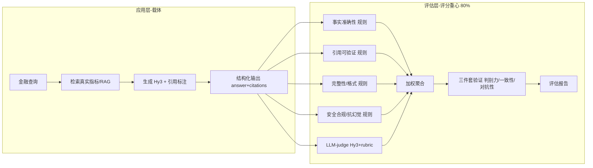

# 技术方案：基于混元 Hy3 的金融 AI 应用与评估方法

> 混元大模型开源实战 · 金融方向个人项目

---

## 核心论点：评估方法学优先

这个项目最关键的定位是——**它不是一个"做应用"的项目，而是一套"定义什么是好的金融 AI 输出"的评估方法论研究**。

任务把约 80% 的评分重心放在「评估方法设计」上，应用本身只是载体。因此我把大部分精力投入到：**如何让"好"变得可操作、可复现、可验证**。我的工作不是训练或微调一个模型（这依赖 8 卡 GPU，对学生不现实），而是基于混元 Hy3 的能力，定义一套严谨的评判标准，并让这套标准本身接受科学检验。

一句话概括：**应用是皮，评估方法论是骨；真正有价值的部分，是这套方法论是否站得住脚。**

---

## 一、项目背景与评分重心

- **任务本质**：基于 Hy3 构建一个 AI 应用，并自行设计该场景下的评判标准——场景开放、无标准答案，因此"好"必须自己定义。
- **评分重心**：评估方法设计约占 80% 权重，应用实现约占 20%。这是本项目所有技术取舍的总依据。
- **我的应对**：把工程重心从"模型/应用多花哨"转移到"评估多严谨、多可复现"，用可操作的 rubric 与可证伪的验证实验证明评估方法的可靠性。

## 二、选题与场景定义（金融方向）

我选择**金融（财报阅读 / 财务问答 / 公告摘要）**作为场景，理由有三：

1. **数据公开、零成本**：上市公司年报、公告、财务数据均可通过 akshare、巨潮资讯等公开接口批量获取，无需付费数据。
2. **事实可核验**：金融数值有唯一真相（如扣非净利润），便于设计"事实准确性"硬判定，也便于构造反例（故意改错数字即可）。
3. **反例易造、评估可证伪**：把"非经常性损益伪装成主营""编造未披露指标"等，天然成为评估器的对抗素材。

**三要素说明**：目标用户 = 需要快速阅读财报/公告的投资者与从业者；痛点 = 长文档信息密度高、易遗漏关键风险；为何必须大模型 = 传统规则/检索无法做跨段落综合推理与结构化归纳。

## 三、技术路径设计思路

| 路径 | 定位 | 取舍 |
|---|---|---|
| **A+B（采用）** | 轻量 LLM-judge 打底 + RAG 引用可验证作亮点 | 最稳且出彩，评估有"硬维度" |
| A（轻量 LLM-judge） | 仅规则 + Hy3 裁判 | 最稳但亮点不足 |
| C（多 Agent 对抗） | 生成/裁判/复核/对抗多角色 | 出彩但调试与成本风险高 |

**为什么选 A+B**：以 A 保证全程可交付，叠加 B 的"引用可验证性"硬规则作为评估差异化亮点，且金融数据天然适合做引用溯源。

**关键澄清**：多 Agent 指**同一 Hy3 模型 + 不同角色 Prompt**，绝非换用其他模型——既满足"基于 Hy3"要求，又避免对"是否真用 Hy3"的质疑。

## 四、系统架构（应用层与评估层解耦）



应用层负责"把问题答出来"，评估层负责"判定答得好不好"——两层完全解耦，评估不依赖应用是否完美，应用更迭不影响评估体系。

## 五、重点技术

- **RAG 检索增强**：先检索真实财务指标/公告片段再生成，降低金融场景幻觉。
- **引用可验证（A+B 核心硬维度）**：要求输出标注引用来源，规则校验其是否能在真实数据定位，伪造引用被自动抓出。
- **规则校验兜底**：数值相对误差、单位、JSON 结构等确定性校验，保证可复现。
- **LLM-as-Judge**：用 Hy3 按 rubric 打分，作为交叉验证；其分数与规则分比对，构成"一致性"实验。
- **评估方法自验证**：判别力 / 一致性 / 对抗性三件套，让评估方法本身接受检验。

## 六、评估方法设计（本项目的灵魂）

我设计了 **8 个维度、每个维度 3 档（1.0 / 0.5 / 0.0）的可操作 rubric**。判定标准全部用**可量化阈值**，而非"较好/基本符合"等模糊词——任何评审者按此都能复现出接近的分数。

| 维度 | 权重 | 满分(1.0) 标准 | 0.5 标准 | 0 分标准 |
|---|---|---|---|---|
| **事实准确性** | 0.18 | 数值与真实指标相对误差 ≤1% | 同量级但误差 ≤20% | 数值错误或缺失关键数值 |
| **引用可验证性** | 0.18 | citations 字段可定位到真实指标/来源 | 提及来源但无法精确追溯 | 无任何引用或来源声明 |
| **完整性** | 0.12 | 完整覆盖问题全部要点 | 部分覆盖或回避部分要求 | 明显遗漏关键要点 |
| **格式规范性** | 0.05 | 结构化、单位清晰 | 基本可读但欠规范 | 混乱不可读 |
| **安全合规/抗幻觉** | 0.16 | 识别陷阱/无编造、表述审慎 | 给真实值但未指出陷阱 | 附和错误前提或编造数据 |
| **数值计算/衍生指标正确性** | 0.13 | 衍生指标计算正确（误差≤1%） | 方向对但数值偏差≤20% | 计算错/用错基数/方向反 |
| **不确定性校准/审慎性** | 0.10 | 缺失/不确定时指向权威源 | 含糊带过未编造 | 对未知编造假精确 |
| **可解释性/推理透明** | 0.08 | 展示来源/计算/推导依据 | 有简要依据不够清晰 | 仅给结论无依据 |

> 2026-08-31 扩充：新增「计算 / 校准 / 可解释」三维度。其中**计算维度**在闭卷模式（`--no-rag`）下才显出真正判别力——它考的是模型自身的算术，而非抄表；**校准维度**专门检验"模型是否知道自己不知道"，是 LLM 评测的经典硬轴。

**可操作化举例**：事实准确性不用"答案是否正确"这种主观判断，而用"相对误差 ≤1% 给满分、≤20% 给半分"的硬阈值；引用可验证要求输出必须带 `citations` 且能在真实数据集中定位。

**真相来源**：评估器对照**真实公开财务数据**（非样本里可能故意写错的 reference），反例样本靠"安全合规维度"识别——这正是引用可验证理念的体现，也从设计上堵死了"反例反而被判对"的漏洞。

**评分公式**：`overall = Σ(维度分 × 维度权重) × 100`。

## 七、评估方法有效性验证（三件套）

仅有 rubric 不够，我让**评估方法本身接受检验**，这是方法论严谨性的关键证据：

- **判别力**：人工构造 好 / 中 / 差 / 对抗 四档已知质量输出，验证评估能否正确排序（好 > 中 > 差，且对抗应显著低分）。
- **一致性**：评估分与人工锚定评级（A/B/C/D）做相关性检验（如 Spearman），证明评估与人工判断吻合。
- **对抗性**：用堆术语、伪引用、编造数字、注水篇幅的输出，验证评估能否识破——最能体现方法的严谨。

> 这一节的意义在于：不是"用模型给模型打分"就完事，而是用实验证明"我的评分标准是可靠的"。这恰恰是项目最看重的。

## 八、样本集方案（零成本、含难例反例）

- **规模**：81 条。财报指标提取 26 + 财务问答 20 + 公告摘要 15 + 评估器验证集 20。
- **难度构成**：应用样本 61 条中，难例+反例 = 25 条（占比 41%），远超任务书 ≥30% 要求。
- **零成本来源**：akshare 财务分析指标、巨潮披露列表真实标题，全部公开接口获取，无付费、无版权包袱。
- **反例构造**：全部为"确定性改错"（数量级错误、错误前提、编造内容），不引入幻觉数据。
- **字段设计**：`id / 子任务 / 难度 / 输入文本 / 参考输出 / 人工锚定评级 / 来源 / 是否反例`。

## 九、预期效果（目标，非实测）

- 评估器在验证集上**正确区分好/中/差/对抗四档**，且对抗样本显著低分；
- 评估分与人工锚定评级**高度一致**（目标高相关）；
- 应用层输出**结构化 + 带引用标注**，引用可验证维度稳定满分；
- 全流程**零成本、一键复现**，代码与样本全量开源。

## 十、时间规划（8.21 – 9.11，共 22 天）

| 里程碑 | 时间 | 目标 |
|---|---|---|
| M1 立项与调通 | 8.21–8.24 | 定方向、搭仓库骨架、调通 Hy3 API（key 走环境变量，绝不硬编码/提交） |
| M2 应用开发 | 8.25–8.31 | 实现"输入→应用→输出"闭环，预留评测接口 |
| M3 评估方法设计+验证 | 9.1–9.7 | 确定 ≥5 维度 + 可操作 rubric，跑判别力/一致性/对抗性三件套 |
| M4 评测与交付 | 9.8–9.11 | 完整评测 → 结果表 + 归因 → 分析报告 → ≤2 分钟 demo → 开源 |

```
M1 ████
M2 ███████
M3 ███████
M4 ████
```

## 十一、交付物与开源

- 公开 GitHub 仓库：应用源码 + README + 方案文档 + 评测脚本 + 分析报告 + demo。
- 工程规范：`.gitignore` 屏蔽 `.env`/`memory/`；密钥仅走环境变量；附 `.env.example` 模板。
- 可复现：样本集由 `build_finance_samples.py` 一键重建。

## 十二、风险与边界

- **密钥红线**：API key 永远走环境变量，绝不硬编码、绝不提交仓库（任务书明确写死）。
- **合规边界**：样本全部脱敏、使用明确可 reuse 的公开源；输出定位"辅助阅读"，非专业法律/投资结论。
- **模型边界**：应用层与评估裁判均基于 Hy3，不混用其他模型，确保"基于 Hy3"成立。

---

## 附录：备选路径简述

- **路径 A（轻量 LLM-judge）**：Hy3 当函数 + Hy3 当裁判 + 规则兜底，复杂度最低、22 天最不易翻车。
- **路径 C（多 Agent 对抗）**：生成/裁判/复核/对抗多角色编排，一致性最佳但调试与 token 成本风险高，仅时间充裕时上。
