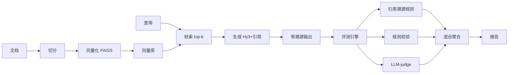

# 路径 A+B：LLM-judge + RAG 引用可验证 技术路径方案


以下是本项目的第二套技术路径——**路径 A+B（LLM-judge + RAG 引用可验证）**。它在路径 A 的底座上，叠加「引用可验证性」硬规则作为评估亮点，从设计思路、系统架构、重点技术、预期效果与时间规划五个方面阐述。

---

## 一、我的设计思路

我以路径 A 为底座，引入轻量检索增强（RAG）提升事实准确性，并在评估层新增**「引用可验证性」硬维度**——生成中每句引用都能在原文定位，伪造引用被自动抓出。该设计最贴合「AI 应用 + 评判标准设计」主题，且金融数据可零成本批量获取，RAG 有真实素材：

- 我让应用层先做检索再生成，减少幻觉、提升事实准确率；
- 我的评估新增「引用溯源规则」，要求输出标注来源片段 id，规则校验是否可在向量库定位；
- 我已在样本集构造的「把非经常性损益伪装成主营」「编造未披露数字」等反例，正好作为该维度的对抗素材，直接验证判别力。

## 二、我的系统架构

```
[年报/公告 文本] ─► 切分 ─► 向量化(FAISS) ─► 向量库
                                            │
[查询] ─► 检索 top-k ─► [生成 Hy3 + 引用标注] ─► [输出(带溯源片段id)]
                                            │
                                      [评测引擎]
                                       ├─ 引用溯源规则 (句子↔片段可定位?)
                                       ├─ 规则校验 (含数值/单位/JSON)
                                       └─ LLM-judge (Hy3 + rubric)
                                            │
                                       [混合聚合 + 报告]
```



## 三、我计划采用的重点技术

- **文本切分**：按段落 / 滑动窗口切分，控制单片段长度适配 embedding；
- **Embedding + 向量检索**：用开源 embedding + FAISS/chroma，无需外部付费服务；
- **引用溯源 / 归因**：要求输出标注引用来源片段 id，规则校验是否可在向量库定位；
- **幻觉检测**：对比生成数值与检索片段数值的一致性（金融场景尤其关键）；
- **混合打分**：可验证性（硬，权重高）+ 多维度（软，rubric）加权聚合。

## 四、我的预期效果

- 应用更「真实可用」，评估多出一个**硬维度**，最贴合主题，易出彩；
- 工程量比 A 多约一周（RAG 管线）；
- 反例（伪造引用/编造数字）能被自动识别，判别力验证更有说服力。

## 五、我的 22 天时间规划（8.21–9.11）

| 里程碑 | 时间 | 我的任务 |
|---|---|---|
| M1 调通 | 8.21–8.24 | 同路径 A：建仓库、调通 Hy3 API |
| M2 应用+RAG | 8.25–9.2 | 应用闭环 + RAG 管线（切分/向量化/检索/引用标注） |
| M3 评估+验证 | 9.3–9.9 | ≥5 维度 + rubric、引用溯源规则、跑判别力/一致性/对抗性 |
| M4 交付 | 9.10–9.11 | 完整评测→结果表+归因→分析报告→demo→开源 |

> 比路径 A 紧 5–7 天，我会严格控制 M2 周期。

## 六、我的风险与对策

- **RAG 检索不准** → 调切分粒度与 top-k，用规则校验兜底，不依赖检索完美；
- **时间超支** → 若 M2 超期，降级为纯 A（去掉检索，保留引用校验维度的静态版）。

## 七、与我已建样本集的衔接

我已构建的公告标题 / 指标文本可构建检索库；财报指标提取样本提供「标准答案数值」用于幻觉检测比对。25 条难例/反例天然是引用验证的对抗素材（如编造未披露数字必被溯源规则判低分）。

---

## 附：三方案对比（我的评估）

| 维度 | A | A+B（本方案） | C |
|---|---|---|---|
| 复杂度 | 低 | 中 | 高 |
| 出彩点 | 评估严谨 | +引用可验证 | +对抗稳健 |
| 风险 | 低 | 中 | 高 |
| 我的选择建议 | 起步首选 | ⭐ 想冲分首选 | 时间充裕才上 |

以上为路径 A+B 方案。
