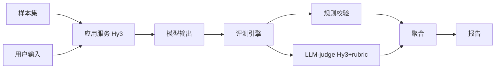

# 路径 A：轻量 LLM-as-Judge 技术路径方案


以下是本项目的第一套技术路径——**路径 A（轻量 LLM-as-Judge）**，从设计思路、系统架构、重点技术、预期效果与时间规划五个方面阐述。

---

## 一、我的设计思路

通过研读任务书，我明确本项目的评分重心在于「评估方法设计」（约占 80%），AI 应用本身只是载体。因此我选择用**最低复杂度换取「应用可跑 + 评估可复现」的完整闭环**：

- 我让 Hy3 同时承担「答题者」与「裁判」两个角色，仅靠不同的 system prompt 区分；
- 我的评估由「LLM-as-judge（按 rubric 打分）+ 规则校验（兜底硬指标）」两部分组成；
- 这样既能保证在 22 天内稳定交付，又能把主要精力投入到评分最看重的评估方法上。

## 二、我的系统架构

```
[样本集 samples.json] ─┐
                       ├─► [应用服务] ── Hy3 API(Prompt模板) ──► [模型输出]
[用户输入/测试输入] ────┘                                         │
                                                            ▼
                                              [评测引擎]
                                                ├─ 规则校验(含数值/单位/JSON可解析/术语白名单)
                                                └─ LLM-judge(Hy3 + rubric 打分表)
                                                            │
                                                            ▼
                                                  [分数聚合 + 报告]
```



## 三、我计划采用的重点技术

- 调用 Hy3 的 OpenAI 兼容 API（API Key 走环境变量，绝不硬编码/提交，严守任务书红线）；
- 设计 few-shot rubric prompt，为每个维度给出「好 / 中 / 差」示例与判定边界；
- 要求 Hy3 返回结构化 JSON（维度分 + 理由）并做容错解析；
- 用一致性统计（与人工锚定评级算相关性、同份输出跑 3 次看方差）和判别力实验（好/中/差/对抗四档排序）验证评估有效性。

## 四、我的预期效果

- 预计 1–2 周即可跑出完整闭环，评估严谨度足以达到基础分要求；
- 我清楚其短板：「生成与裁判使用同一模型」可能带来系统性偏差，因此我用规则校验硬指标兜底；
- 该方案能完整覆盖任务书对「评估维度 ≥5、标准可操作、验证三件套齐全」的要求。

## 五、我的 22 天时间规划（8.21–9.11）

| 里程碑 | 时间 | 我的任务 |
|---|---|---|
| M1 调通 | 8.21–8.24 | 定方向、建仓库骨架、调通 Hy3 API（key 走环境变量） |
| M2 应用 | 8.25–8.31 | 实现「输入→应用→输出」闭环，预留评测接口 |
| M3 评估 | 9.1–9.7 | ≥5 维度 + rubric、评测脚本、跑判别力/一致性/对抗性验证 |
| M4 交付 | 9.8–9.11 | 完整评测→结果表+归因→分析报告→≤2 分钟 demo→开源 |

## 六、我的风险与对策

- **裁判偏差** → 加规则校验硬指标兜底；
- **输出不稳定** → 设 temperature=0 并要求 JSON；
- **时间紧** → M2 提前完成则直接进入 M3。

## 七、与我已建样本集的衔接

我已基于 akshare 与巨潮公开数据构建了 81 条金融样本（`D:/finance_samples`），其中应用样本 61 条喂应用、评估器验证集 20 条喂 LLM-judge 测排序；应用样本中难例+反例占 41%，满足任务书 ≥30% 的要求。

---

## 附：三方案对比（我的评估）

| 维度 | A（本方案） | A+B | C |
|---|---|---|---|
| 复杂度 | 低 | 中 | 高 |
| 出彩点 | 评估严谨 | +引用可验证 | +对抗稳健 |
| 风险 | 低 | 中 | 高 |
| 我的选择建议 | ⭐ 起步首选 | 想冲分首选 | 时间充裕才上 |

以上为路径 A 方案。
