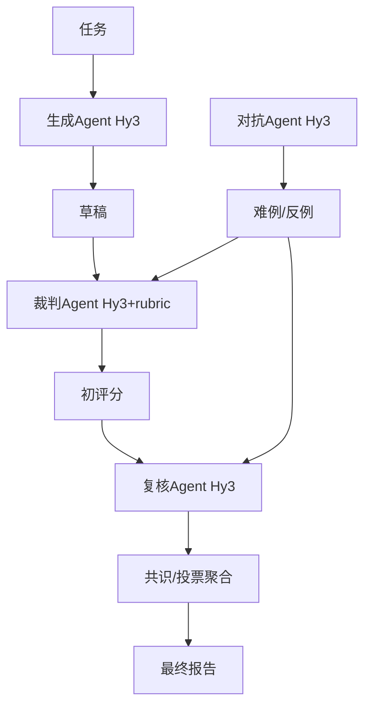

# 路径 C：多 Agent 协作 + 对抗验证 技术路径方案


以下是本项目的第三套技术路径——**路径 C（多 Agent 协作 + 对抗验证）**。它适合时间充裕、希望冲击高分的场景。需要特别说明的是：**所有 Agent 均基于同一个 Hy3 模型，仅靠角色 prompt 区分，不引入其他模型**（符合任务书「基于 Hy3 构建」的要求），从设计思路、系统架构、重点技术、预期效果与时间规划五个方面阐述。

---

## 一、我的设计思路

我将生成与评估都拆成角色，用多角色交叉提升一致性与稳健性，并把对抗样本直接喂回评估以验证判别力。这是一致性 / 稳健性上限最高、但调试成本与 token 成本也最高的方案：

- **四类角色 Agent**（全部 Hy3，仅 prompt 不同）：
  - 生成 Agent：规划 / 检索 / 撰写
  - 裁判 Agent：按 rubric 打分
  - 复核 Agent：专挑裁判的错漏
  - 对抗 Agent：专造难例/反例
- 我用**共识/投票聚合**降低单一裁判偏差；
- 对抗 Agent 在我已构样本上做变异生成难例，直接喂回评估，验证判别力。

## 二、我的系统架构

```
[任务] ─► 生成Agent(Hy3) ─► [草稿]
                        │
                 裁判Agent(Hy3+rubric) ─► [初评分]
                        │
                 复核Agent(Hy3) ─► [复核/纠错]
                        │
                 [共识/投票聚合] ─► [最终报告]
对抗Agent(Hy3) ─► [难例/反例] ─► 喂回评估验证判别力
```



## 三、我计划采用的重点技术

- **Agent 角色化 prompt**：用不同 `system` 区分生成/裁判/复核/对抗，不换模型；
- **编排与状态管理**：轻量状态机自写，或 langgraph（按需），注意失败重试与超时；
- **对抗样本自动生成**：在我已构样本上做确定性变异（改数字、加模糊措辞、注水篇幅）；
- **一致性聚合**：投票 / 加权，并与人工锚定评级做一致性比对；
- **成本控制**：多角色多次调用 token 消耗大，我会设预算上限与结果缓存。

## 四、我的预期效果

- 评估一致性 / 稳健性最佳，是追求评估严谨度的优选；
- 短板：调试成本高、可能跑不通，token 成本明显高于 A/B。

## 五、我的 22 天时间规划（8.21–9.11）

| 里程碑 | 时间 | 我的任务 |
|---|---|---|
| M1 调通 | 8.21–8.24 | 同 A：建仓库、调通 Hy3 API |
| M2 应用 | 8.25–8.31 | 应用闭环（可复用 A 的接口） |
| M3 多Agent+验证 | 9.1–9.9 | 角色编排 + 裁判/复核/对抗 + 判别力/一致性/对抗性验证（风险集中） |
| M4 交付 | 9.10–9.11 | 完整评测→结果表+归因→分析报告→demo→开源 |

> M3 容错空间小，我会先做单 Agent 跑通再并联。

## 六、我的风险与对策

- **编排 bug / 角色不一致** → 先单 Agent 跑通再并联，并保留路径 A 作为降级方案；
- **成本超支** → 限制调用次数、缓存中间结果、降低对抗样本生成规模。

## 七、与我已建样本集的衔接

我已构建的 25 条难例/反例可直接作为对抗 Agent 的输入与人工基准；评估器验证集 20 条用于多 Agent 一致性比对（好/中/差/对抗能否正确排序）。

---

## 附：三方案对比（我的评估）

| 维度 | A | A+B | C（本方案） |
|---|---|---|---|
| 复杂度 | 低 | 中 | 高 |
| 出彩点 | 评估严谨 | +引用可验证 | +对抗稳健 |
| 风险 | 低 | 中 | 高 |
| 我的选择建议 | 起步首选 | 想冲分首选 | ⭐ 时间充裕才上 |

以上为路径 C 方案。
